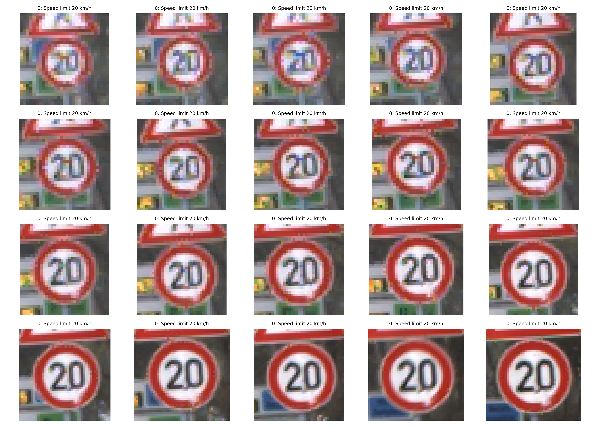
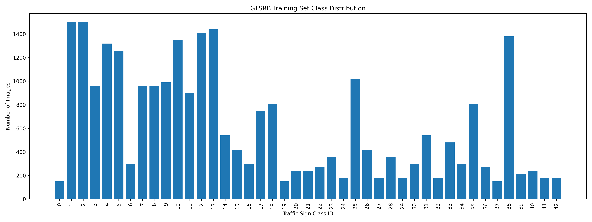
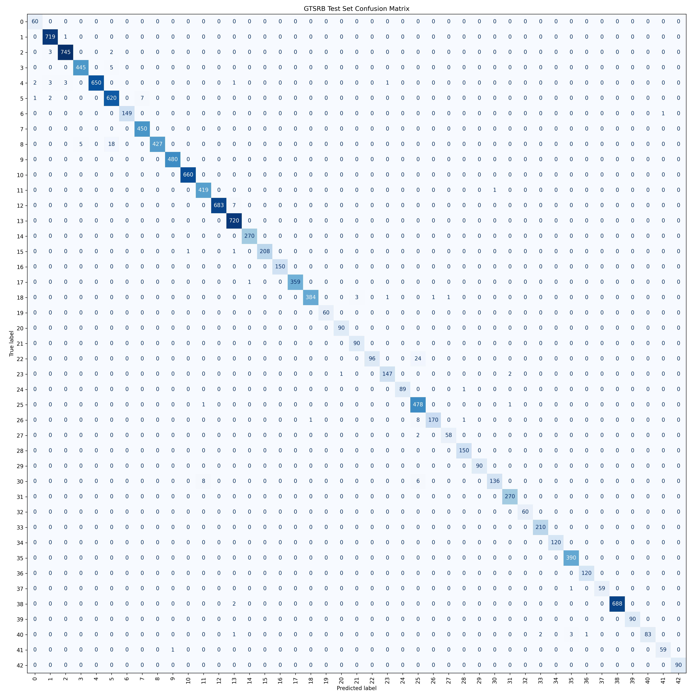

# Traffic Sign Recognition using Fine-Tuned ResNet-18

A deep learning project for classifying traffic signs using a fine-tuned ResNet-18 model on the GTSRB dataset.  
The project includes data preprocessing, model fine-tuning, training, validation, test evaluation, and a Streamlit web application for prediction.

---

## Project Overview

Traffic sign recognition is an important task in driver-assistance and autonomous driving systems.  
This project takes a cropped traffic sign image as input and predicts its correct traffic sign class.

The model is trained to classify traffic signs into **43 classes**, including speed limits, stop signs, yield signs, no-entry signs, warning signs, and direction signs.

---

## Demo Application

The project includes a Streamlit app where users can upload a traffic sign image and receive:

- Predicted traffic sign class
- Confidence score
- Top 3 predictions

Run the app with:

```bash
streamlit run app/streamlit_app.py
```

---

## Dataset

This project uses the **German Traffic Sign Recognition Benchmark**, also known as **GTSRB**.

The dataset is downloaded using TorchVision.

Dataset summary used in this project:

| Split | Number of Images |
|---|---:|
| Training | 26,640 |
| Test | 12,630 |
| Classes | 43 |

The dataset is not uploaded to GitHub because of its size. It is downloaded locally into:

```text
data/raw/
```

This folder is ignored by Git.

---

## Model

The model used is **ResNet-18** pretrained on ImageNet.

The final classification layer was replaced so that the model outputs **43 traffic sign classes** instead of the original ImageNet classes.

Model pipeline:

```text
Input Image
→ Resize to 224 × 224
→ Normalize using ImageNet statistics
→ Fine-tuned ResNet-18
→ Traffic sign class prediction
```

---

## Preprocessing

The preprocessing pipeline includes:

### Training Data

```text
Resize
→ Random rotation
→ Brightness/contrast/saturation augmentation
→ Random translation and scaling
→ Convert to tensor
→ Normalize
```

### Validation and Test Data

```text
Resize
→ Convert to tensor
→ Normalize
```

Image size used:

```text
224 × 224
```

---

## Results

The model was trained and evaluated on the GTSRB dataset.

| Metric | Result |
|---|---:|
| Validation Accuracy | 99.96% |
| Test Accuracy | 98.90% |

Evaluation outputs are saved in:

```text
reports/
```

Generated figures include:

```text
reports/figures/sample_traffic_signs.png
reports/figures/class_distribution.png
reports/figures/training_curves.png
reports/figures/confusion_matrix.png
```

---

## Sample Dataset Images



---

## Class Distribution



---

## Confusion Matrix



---

## Project Structure

```text
traffic-sign-recognition-gtsrb/
│
├── app/
│   └── streamlit_app.py
│
├── configs/
│   └── config.yaml
│
├── data/
│   └── README.md
│
├── models/
│   └── README.md
│
├── reports/
│   ├── classification_report.csv
│   ├── metrics.json
│   ├── test_metrics.json
│   ├── training_history.json
│   └── figures/
│
├── src/
│   ├── dataset.py
│   ├── evaluate.py
│   ├── explore_data.py
│   ├── model.py
│   ├── predict.py
│   ├── train.py
│   └── utils.py
│
├── tests/
│   └── test_predict.py
│
├── requirements.txt
├── README.md
└── LICENSE
```

---

## Installation

Clone the repository:

```bash
git clone https://github.com/hadimss/traffic-sign-recognition-gtsrb.git
cd traffic-sign-recognition-gtsrb
```

Create and activate a virtual environment:

```bash
python3 -m venv .venv
source .venv/bin/activate
```

Install dependencies:

```bash
pip install -r requirements.txt
```

---

## How to Run

### 1. Explore the Dataset

```bash
python3 src/explore_data.py
```

This downloads the dataset and creates sample visualizations.

### 2. Train the Model

```bash
python3 src/train.py
```

The best model checkpoint is saved locally to:

```text
models/best_resnet18_gtsrb.pth
```

Model checkpoint files are ignored by Git because they are large.

### 3. Evaluate the Model

```bash
python3 src/evaluate.py
```

This creates:

```text
reports/test_metrics.json
reports/classification_report.csv
reports/figures/confusion_matrix.png
```

### 4. Run the Streamlit App

```bash
streamlit run app/streamlit_app.py
```

Then open the local URL shown in the terminal.

---

## Technologies Used

- Python
- PyTorch
- TorchVision
- ResNet-18
- scikit-learn
- Matplotlib
- Pandas
- Streamlit

---

## Project Goals Completed

- Image data preprocessing
- Fine-tuning an existing pretrained model
- Training and validation
- Test-set evaluation
- Streamlit application for real-world use

---

## Future Improvements

- Add real-time webcam prediction
- Compare ResNet-18 with MobileNetV3
- Deploy the Streamlit app online
- Add object detection for traffic signs in full road images
- Export the model to ONNX for lightweight deployment

---

## Author

**Hadi Al Masri**